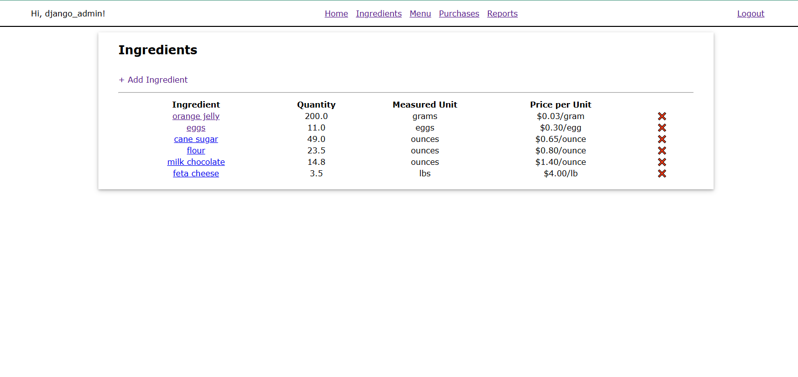

# djangodelights

## Summary
"Django Delights" is a demo project for the end of the Codecademy Django course to practice setting up models and deployment via local server and to GitHub version control. Bash was used for creating a local virtual environment, in which the Django project and 'Inventory' app were initialised, as well as Model instances being created.

## Structure
Within the Django project, there is an app titled 'Inventory', which contains 4 models (Ingredient, MenuItem, RecipeRequirement, and Purchase). The intention of these is to represent items on a restaurant's menu, with its associated ingredients and how many of each are needed to produced that item. The Purchase model then represents a Customer ordering one of these items, and should reduce the quantity of the ingredients in stock accordingly.

## Get Started

```bash
python manage.py runserver <8000>
```

Then navigate to [localhost](http://localhost:8000/).

## Screenshots

